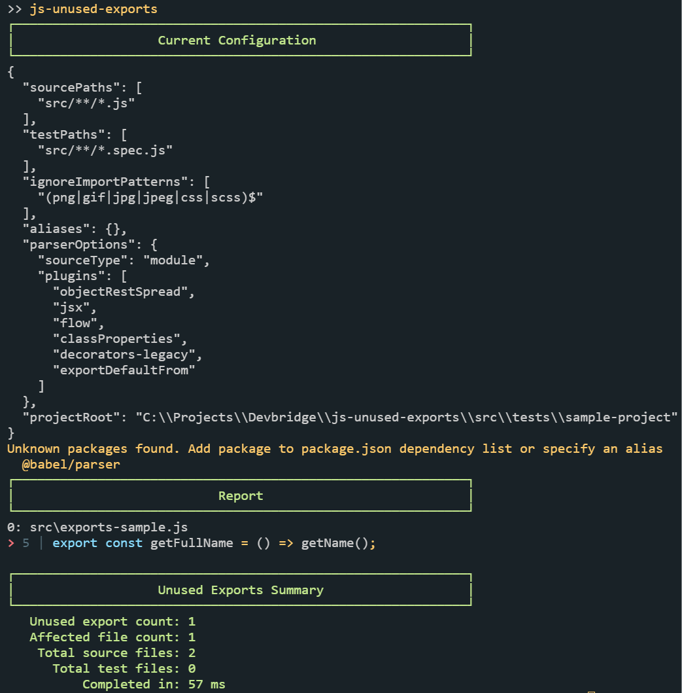

# Unused Exports

Tool for identifying and reporting unused exports found in ECMAScript/JavaScript code.

You may think of it as ESLint `no-unused-vars` rule, but for the whole project scope.

Tool uses [Babel parser](https://babeljs.io/docs/en/babel-parser) to parse source code. You can provide custom parser options using config file.

## Instalation

```shell
npm install -g js-unused-exports
```

## Usage

```pre
Usage: js-unused-exports [options]
 E.g.: js-unused-exports --config "unused-exports-config.json"

Options:
  -v, --version        output the version number
  -c, --config [path]  path to the JSON config file
  -o --out-dir [path]  path to print scan results as JSON
  -f, --fix            automatically remove "export" directive where possible
  -h, --help           output usage information
  ```



## Configuration

```javascript
{
  // Root project directory or CWD (default)
  projectRoot: '',

  // Source paths relative to project root
  sourcePaths: ['src/**/*.js'],

  // Patterns for files that should be ignored
  ignorePaths: [],

  // Test file patterns
  testPaths: [
    'src/**/*.spec.js'
  ],

  // Import patterns to ignore
  ignoreImportPatterns: [ '(png|gif|jpg|jpeg|css|scss)$' ],

  // If you use alias in you codebase you can specify them here, e.g.:
  aliases: {
    components: 'src/components'
  },

  // @babel/parser options for parsing source code
  // https://babeljs.io/docs/en/babel-parser
  parserOptions: {
    sourceType: 'module',
    plugins: [
      'objectRestSpread',
      'jsx',
      'flow',
      'classProperties',
      'decorators-legacy',
      'exportDefaultFrom'
    ]
  }
}
```
